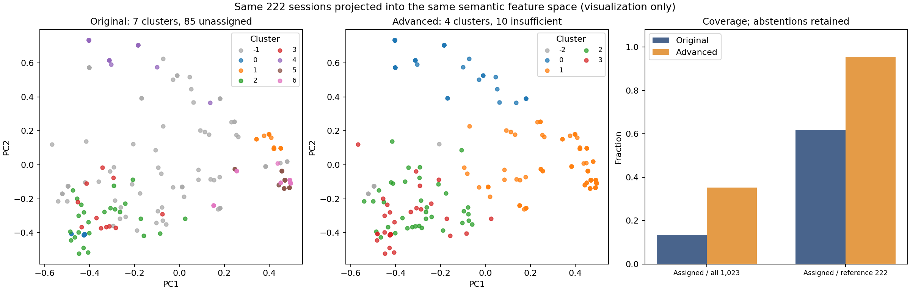

# Dignolucir 개선 클러스터링 결과 및 품질 평가

## 1. 결과와 적용 범위

**행동·페이지·행동 전이를 분리한 TF-IDF와 K-means(k=4)를 적용했다.** 중복 패턴은 한 번만 학습하고 동일 패턴의 모든 세션에 복원한다. 결과는 [advanced_cluster_results.csv](advanced_cluster_results.csv)에 **전체 1,023개 세션을 한 행씩** 보존한다.

- 기존 222개 기준: **137 → 212개 배정**, 85개 노이즈 중 **75개 복구**, 나머지 **10개는 행동 근거 부족**으로 표시.
- 전체 1,023개 기준: **137 → 361개 배정(13.39% → 35.29%)**. 추가 224개는 기존 노이즈 75개와 중복 제한으로 빠졌던 149개이다.
- **614개는 행동 근거 부족**, **48개는 기준 패턴 밖 또는 배정 불확실**로 유지한다. 이것들을 고객 행동 군집에 억지로 포함하지 않는다.
- 48개의 새로운 패턴 세션은 이번 거리·margin gate에서 모두 보류됐다. 따라서 이번 실행에서 **OOV 세션 복구 성과를 입증한 것은 아니다**.

개선된 점은 **해석 가능한 표현에서의 분리도, 적용 범위, 그룹 재학습 안정성**이다. 기존 BERT 공간의 분리도는 오히려 낮아졌다. 전 영역에서 우월한 모델 또는 운영 정확도 향상으로 주장하지 않는다.

## 2. 개선 파이프라인

1. 두 CSV를 session_id로 결합하고 ID 유일성·31,909 이벤트 합계를 검증했다. 원본은 수정하지 않았다.
2. 의미 토큰 3개 이상이면서 시작·종료·탭·비활성 외 행동이 최소 1개 있는 세션을 학습 가능으로 정의했다. 이 기준도 정답 품질 판정은 아니다.
3. 222개 중 212개, 고유 패턴 **135개**를 학습한다. 같은 패턴이 5번 나타나도 학습 가중치는 한 번이다.
4. 시퀀스 전체를 사용한다. `[CLS]`·세션 시작/종료·탭·비활성 토큰은 특징에서 제외한다. 가격·리뷰·상품·이미지·옵션 등의 행동은 유지한다.
5. `행동 unigram 65% + 페이지 15% + 인접 행동 전이 20%` 블록을 구성한다. 각 블록은 sublinear TF(1+log count), IDF, L2 정규화 후 **가중치 제곱근**을 곱해 연결하고 다시 정규화한다. 총 **260차원**이다. 수치는 이 실험의 고정 설계 선택이며 보편 최적 가중치가 아니다.
6. 전이는 연속 동일 행동을 압축한 후 `행동A>행동B`로 만든다. 전체 문맥 토큰 조합 대신 요소를 분리해 어휘 조합 의존성을 줄인다. 기존 raw 이벤트의 정확성을 새로 검증한 것은 아니다.
7. 개발 비교에서 선택한 K-means(k=4), `n_init=30`, seed=20260910를 고정한 뒤 모든 고유 패턴으로 다시 학습한다.
8. 기준 패턴과 완전히 같으면 군집을 복원한다. 새 패턴은 가장 가까운 centroid를 후보로 삼되 군집 학습 거리의 95백분위 이내이고 상대 거리 margin≥0.05일 때만 배정한다. 이는 설명 가능한 보류 규칙이며 확률 보정된 신뢰구간이 아니다.

원시 이벤트 빈도·장바구니·구매 클릭·서버 수신 시간은 **모델 선택용 정답이나 특징에 넣지 않고** 사후 해석용으로 보존했다. 다만 의미 시퀀스에 ADD_CART·CLICK_BUY 등은 포함되므로 구매 의도 집중도가 독립적인 외부 검증은 아니다.

## 3. 탐색 및 검증 설계

3개 표현(BERT, 완전 토큰 TF-IDF, 분리 TF-IDF) × 31개 설정, **총 93개 후보**를 비교했다. 알고리즘은 K-means, Ward, average-linkage, HDBSCAN, DBSCAN이다.

- K-means·Ward·average: k=2~8.
- HDBSCAN: min_cluster_size=5/8/12 × min_samples=2/4.
- DBSCAN: eps=0.3/0.5/0.7/0.9, min_samples=3.
- 개발 후보 조건: 배정률≥85%, 군집 2개 이상, 최소 고유 패턴 5개, 최대 군집 비중≤80%, 10회 80% 재표집 ARI 평균≥0.75.
- 위 조건을 통과한 후보 중 **각 표현 내부**에서 개발 실루엣이 가장 큰 설정을 선택했다. 0.75 등의 기준은 이번 운영 용도에 설정한 조건이지 업계 평균이 아니다.
- 개선 목적이 반복 문맥·수명주기 영향 완화와 행동 해석이므로 최종 표현은 분리 TF-IDF를 채택했다. BERT 후보보다 모든 점수가 높아서 선택한 것은 아니다.

| 표현 | 선택 알고리즘 | 개발 실루엣 | 개발 ARI | 보류 패턴 실루엣 |
| --- | --- | --- | --- | --- |
| bert | kmeans k=5 | 0.2623 | 0.8350 | 0.2773 |
| atomic | kmeans k=8 | 0.2129 | 0.7788 | 0.1830 |
| factorized | kmeans k=4 | 0.1728 | 0.8863 | 0.2212 |

개발 101개/보류 34개는 **서로 다른 완전 시퀀스 그룹**으로 분리했다. TF-IDF의 IDF·어휘는 개발 데이터만으로 구성하여 보류 데이터를 변환했다. 보류 라벨은 개발 centroid로 배정한 것이며, 그 단계에는 거리 gate를 사용하지 않았다.

**한계:** 첫 시도에서 수명주기만 있는 패턴의 군집을 확인한 후 학습 자격 규칙을 수정했다. 따라서 보류 결과도 이번 탐색 과정의 진단으로 봐야 하며 완전히 손대지 않은 외부 테스트 성적으로 간주할 수 없다. 또한 기존 BERT 사전학습이 이 패턴을 보았는지는 확인할 수 없어 BERT 후보의 보류 성적은 encoder 수준의 독립 검증이 아니다.

## 4. 공정한 품질 비교

분리도는 **기존에 군집이 배정된 동일 137개 세션**을 공통 평가 집합으로 사용한다. 양쪽이 같은 거리 공간을 쓰는 표만 직접 비교한다. 군집 수가 7→4로 줄어들어 운영 분류의 세밀함도 달라졌다.

| 공통 137개, 분리 TF-IDF 공간 | 기존 7군집 | 개선 4군집 |
| --- | ---: | ---: |
| Euclidean 실루엣 | 0.3258 | 0.4074 |
| Davies–Bouldin | 1.6308 | 1.2018 |
| 음수 실루엣 비율 | 11.68% | 1.46% |

| 공통 137개, 기존 BERT 공간 | 기존 7군집 | 개선 4군집 |
| --- | ---: | ---: |
| Euclidean 실루엣 | 0.4322 | 0.3827 |
| Davies–Bouldin | 0.8743 | 0.9295 |

**새 표현 공간에서는 좋아졌지만 BERT 공간에서는 악화됐다.** 새 표현을 설계한 뒤 그 공간에서 평가한 결과이므로 외부 사업 성과 개선으로 확대 해석하지 않는다.

| 적용 범위별 개선 결과 | 배정 수 | 실루엣: 분리 TF-IDF |
| --- | ---: | ---: |
| 기존 222개 중 배정 | 212 | 0.2771 |
| 고유 학습 패턴 | 135 | 0.1864 |
| 전체 1,023개 중 배정 | 361 | 0.4267 |

361개 점수가 높은 이유에는 동일 패턴 149개 복원이 포함된다. 이를 212개 점수보다 일반화 성능이 높아졌다는 근거로 쓰지 않는다. 정보 부족·보류 세션은 위 실루엣 계산에서 제외되지만 CSV에는 모두 남아 있다.

### 실제 재학습 안정성

같은 142개 원본 고유 패턴에서 80%를 뽑는 실험을 30회 반복했다. 기존 방법은 해당 그룹의 원래 중복 행을 유지해 HDBSCAN을 재학습한다. 개선 방법은 행동이 있는 고유 패턴만 사용해 **TF-IDF와 K-means를 둘 다 다시 학습**한다. 선택된 그룹마다 한 표로 ARI를 계산하고, 노이즈·정보 부족 상태도 포함한다. 각 방법의 전체 학습 결과에 대한 안정성이므로 두 방법의 라벨 자체를 정답처럼 비교한 것은 아니다.

| 그룹 재학습 ARI | 기존 | 개선 |
| --- | ---: | ---: |
| 평균 | 0.7810 | 0.9168 |
| 10백분위 | 0.6384 | 0.8639 |
| 90백분위 | 0.9265 | 0.9715 |

별도로 특징을 고정한 135개 패턴 재표집 ARI 평균은 **0.9213**이다. 특징 재학습을 포함하는 표 위 수치를 우선 해석한다. ARI는 정확도가 아니라 반복 배정 안정성이다. [ARI 공식 문서](https://scikit-learn.org/stable/modules/generated/sklearn.metrics.adjusted_rand_score.html).

임의로 군집 크기를 유지한 라벨 순열 100회의 실루엣 평균은 -0.0295, 95백분위는 -0.0191였다. 군집 구조가 무작위보다는 분명하다는 기술적 참고이며, 후보 탐색 이후의 유의확률이나 외부 검증은 아니다.

## 5. 새로운 군집과 활용

| 군집 | 이름 | 전체 세션 | 222개 기준 세션 | 장바구니 이벤트 | 구매 클릭 이벤트 |
| --- | --- | --- | --- | --- | --- |
| 0 | 리뷰 관련 신호 중심 | 97 | 40 | 0 | 0 |
| 1 | 상품·가격 확인 중심 | 193 | 103 | 0 | 0 |
| 2 | 다양한 상호작용·구매 시도 포함 | 36 | 36 | 8 | 6 |
| 3 | 상품·카테고리 반복 탐색 | 35 | 33 | 0 | 0 |
| -2 | 행동 근거 부족 | 614 | 10 | 0 | 0 |
| -1 | 기준 밖 또는 배정 불확실 | 48 | 0 | 0 | 0 |

- **C0 리뷰 관련 신호 중심:** 리뷰로 매핑된 재방문·체류를 주로 포함한다. 직접 리뷰 이벤트나 구매 완료를 의미하지 않는다. 리뷰 UI 개선 가설을 세운 뒤 실제 이벤트·화면과 대조한다.
- **C1 상품·가격 확인 중심:** 기존 C1·C5·C6 등의 유사한 탐색 행동을 더 큰 운영 유형으로 정리한다. 가격·배송·옵션 정보 노출을 검토할 수 있으나 “가격 때문에 이탈”했다고 확정하지 않는다.
- **C2 다양한 상호작용·구매 시도 포함:** 장바구니 이벤트 8개, 구매 클릭 6개, 비회원 구매 버튼 이벤트 1개가 이 군집에 모였다. 구매자·전환 완료 집단이라는 이름을 사용하지 않는다. 장바구니·결제 시작 후 경로 점검 우선 대상이다.
- **C3 상품·카테고리 반복 탐색:** 상품·스크롤·카테고리 이동이 반복된다. 상품 비교 지원이나 탐색 동선을 검토하는 가설에 활용한다.
- **-2/-1:** 고객 유형이 아닌 보류 상태다. 이탈자·봇·비구매자로 간주하지 않는다.



두 산점도는 동일 222개와 동일 특징 PCA를 사용한다. 2차원은 특징 분산의 **37.2%**만 설명하며, 그림의 모양을 실루엣 계산의 대체물로 사용하지 않는다. CSV 좌표는 고유 패턴 135개에 fit한 별도 PCA이므로 이 그림의 좌표와 구분한다.

## 6. CSV 사용법

CSV는 UTF-8 BOM, 1,023행이며 원본 세션 ID·기간·원시 이벤트 집계·완전 시퀀스를 보존한다.

| 컬럼 | 의미 |
| --- | --- |
| cluster | 새 군집 0~3, -2=행동 근거 부족, -1=기준 밖/불확실 |
| cluster_label | 집계 행동을 근거로 붙인 설명용 이름 |
| in_reference_222 | 기존 222개 비교 표본 포함 여부 |
| original_cluster / original_cluster_probability | 기존 값 보존. 기존 값이 없던 세션은 빈 값 |
| assignment_status | reference_fit / exact_pattern_transfer / insufficient_behavior / out_of_reference_or_ambiguous |
| centroid_distance | 새 특징 공간에서 가장 가까운 중심까지 Euclidean 거리 |
| distance_margin | (두 번째 거리−첫 번째 거리)/두 번째 거리. 확률 아님 |
| has_cart_event / has_purchase_intent_event | 원시 이벤트에 근거한 부가 표식 |
| confirmed_purchase_event_count | 제공 데이터의 purchase_success/purchase_complete 합계. 모두 0이며 실제 미구매 확정이 아님 |
| sequence / semantic_sequence | 전체 의미 시퀀스. 이번에는 127토큰으로 자르지 않음 |
| original_length / used_length | 완전 시퀀스 토큰 수. 같으며 모델은 해당 시퀀스에서 특징을 추출 |
| pca_x / pca_y | 새 특징의 시각화용 좌표. 기존 CSV 좌표와 축이 다름 |

K-means에는 기존 HDBSCAN의 membership probability와 같은 값이 없으므로 새 `probability`를 만들어 채우지 않았다. `original_cluster_probability`도 정답 확률로 해석하지 않는다. 운영 `/api/classify`와 모델 형식이 다르므로 이 CSV를 복사하는 것만으로 운영 모델이 교체되지는 않는다.

## 7. 후속 개선 우선순위

1. 원시 event timestamp와 탭·페이지 단위로 세션 품질을 점검한다. CSV의 수신 시각만으로 체류 시간·세션 경계를 교정할 수 없다.
2. BOARD/CATEGORY 관련 새 조합 48개 보류를 검토하고, 도메인별 페이지·행동 매핑을 검증한 뒤 학습 범위를 확장한다. threshold만 낮춰 강제 배정하지 않는다.
3. 주문 완료를 서버 주문 데이터와 연결하고 전문가가 대표 세션을 검토한다. 구매 클릭과 완료를 분리해 실제 활용 타당성을 검증한다.
4. 다음 기간 데이터를 별도 고정 테스트로 보관한다. 독립된 시간 구간의 안정성·사업 성과를 확인한 후 운영 적용을 판단한다.
5. AI agent는 대표 세션의 설명·이름·가설 작성 보조로 사용할 수 있다. 정답 라벨을 임의로 생성해 “정확도 향상”을 주장하는 용도로는 사용하지 않는다. 이번 군집은 재현 가능한 수치 알고리즘으로 생성했다.

## 8. 재현 및 산출물

```powershell
python ml/advanced_clustering.py --deps C:/ghostTracker/.analysis-deps
python ml/write_clustering_reports.py --deps C:/ghostTracker/.analysis-deps
```

Python 분석 CSV intermediate를 Artifact Tool에서 읽어 최종 CSV로 내보냈다. 코드만 재실행할 때는 `advanced_analysis/advanced_results_intermediate.csv`에 동일 분석 값이 생성된다. 패키지 버전: {'python': '3.12.14', 'numpy': '2.5.3', 'pandas': '3.0.1', 'sklearn': '1.7.2', 'torch': '2.14.0+cpu'}.

`advanced_analysis/`에는 93개 후보 결과(experiments.json), split.json, final_metrics.json, validation.json, 입력 해시(data_audit.json), 임베딩·특징 배열과 advanced_model.json을 보관한다. 원본 CSV·운영 centroid·체크포인트·DB는 변경하지 않았다. 결과 파일의 재실행 후 무결성 검증을 통과했다.


- [실루엣 정의와 범위](https://scikit-learn.org/stable/modules/generated/sklearn.metrics.silhouette_score.html): 같은 거리 공간에서 비교하며, 정답 정확도가 아니다.
- [군집 평가 지표와 알고리즘 특성](https://scikit-learn.org/stable/modules/clustering.html#clustering-performance-evaluation): 분리도·밀도·군집 형태에 따라 지표 해석이 달라진다.
- [ARI 정의](https://scikit-learn.org/stable/modules/generated/sklearn.metrics.adjusted_rand_score.html): 라벨 번호 순서와 무관한 배정 일치도이며 우연 일치를 보정한다.
- [HDBSCAN 파라미터 선택](https://hdbscan.readthedocs.io/en/latest/parameter_selection.html): 최소 군집 크기와 밀도 조건이 노이즈·군집 수에 영향을 준다.
- [계층적 군집화](https://scikit-learn.org/stable/modules/generated/sklearn.cluster.AgglomerativeClustering.html): 이번 비교에 Ward·average 연결을 포함했다.

